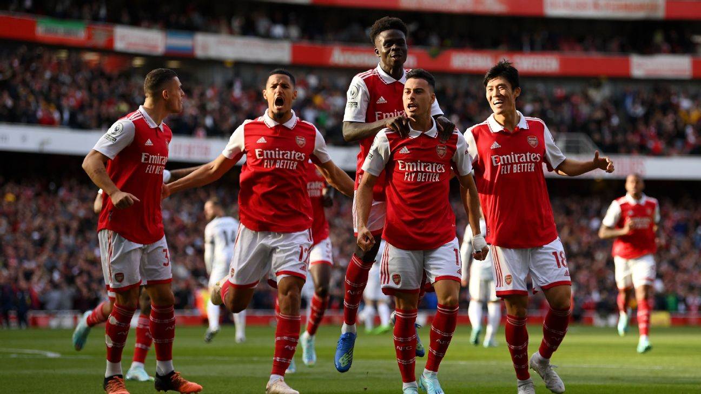
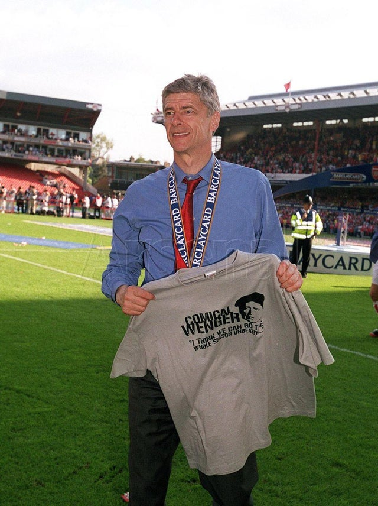

Firstly, happy new year to whoever is reading these! Doubt there's many.

## Arsenal FC

I have been an Arsenal fan since 2013, almost a decade now since I started supporting. It feels surreal to see where we stand today. I realize that it hasn't happened yet, and it also not a statistically significant advantage where it becomes "unthrowable", but it's hard not to be excited!

If I had to guess if we will be the Champions, I would lean a bit to the pessimistic side, as there's so much we've to be careful of and slip ups happen. Would I like us to be Champions? Heck yeah. We just have to wait and see.

## Mesut Özil

I am a huge fan of Dennis Bergkamp. The way he could see the game is incredible, and to add to that, he had almost an inch perfect passing capability over any given distance it seems. When Mesut joined Arsenal from Real Madrid, it felt surreal. He was an established star, he came with plenty of experience, and reputation of having played with the biggest names in world football which included the likes of Cristiano Ronaldo, Karim Benzema etc.

He had a playstyle and understanding of the game which was somewhat akin to Bergkamp's. He turned out to be a prolific player, helping us end a 9 year trophy drought as well as "almost" winning the PL title.
I just wish it would've ended differently with Mesut. Fans singing the infamous chant
>"We've got Ozil (ooh) 
> Mesut Ozil (ooh) 
> I just don't think you understand. 
> He's Arsene Wenger's man, he's better than Zidane. 
> We've got Mesut Ozil"

while sending him off to the next club would've been amazing and deserved, but it is what it is and we move on.

## Martin Ødegaard

I'd known about Martin since 2015 actually. He made a lot of headlines when Real Madrid signed him for a hefty fee for such a young player and also having given him a very high contract where he earned close to or higher than some first team players. Personally, I did not rate him as much at the time. I felt like he was an average player who was just getting the Real Madrid price tag, and I still stand by that judgement for the conditions at that point.

However, he improved his game, and maybe I don't have the best talent identification skills in me, but he's turned out to be a spectacular player. His pass to Gabriel Martinelli (my absolute favorite player at the moment) for the 4th goal against Brighton was so Bergkamp-esque, it just reminded me of prime Ozil, and hence this appreciation post!

I recently found out that before joining Real Madrid, he did visit London Colney (Arsenal's Training Centre) and trained with the first team(supposedly?), so maybe *Le Professeur* knew something I didn't. Which would not surprise me even one bit as that man has the most insane talent ID till date.

## Final remarks

I hope we win the title, and I hope we do it convincingly. I would love to see us challenging for the title regularly again and winning European championships as well. I don't think it's a question of if we will, it's just a question of when. This season? Or in the next 1/2 seasons? Hopefully it's this.

And I will eternally be grateful to Dennis Bergkamp for making me fall in love with this football club. Also indebted to the one and only *Le Professeur*, Arsene Wenger. Everything about that man oozes class and I believe a statue is overdue and also renaming the stadium after him (once the Emirates contract runs out) would be the most sensible thing to do as the man basically built it.

Who else but one of the greatest manager's in the world could have the balls to say "we can go an entire season unbeaten" and actually do it? (Even when the media mocked him for his claims initially.)

> One Arsene Wenger! 
> There's only one Arsene Wenger! 

I'll probably write about Wenger in another post. Might write some football analytics and go over some future talents soon, we'll see.

Till then, 
***THE ARSENAL 📈 TO THE TOP OF THE TABLE! 🚀***

See you in the next one, 
\- Paradox ❤️